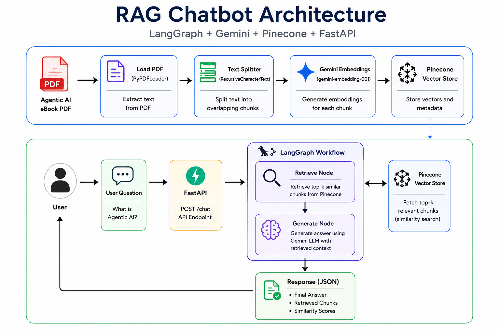
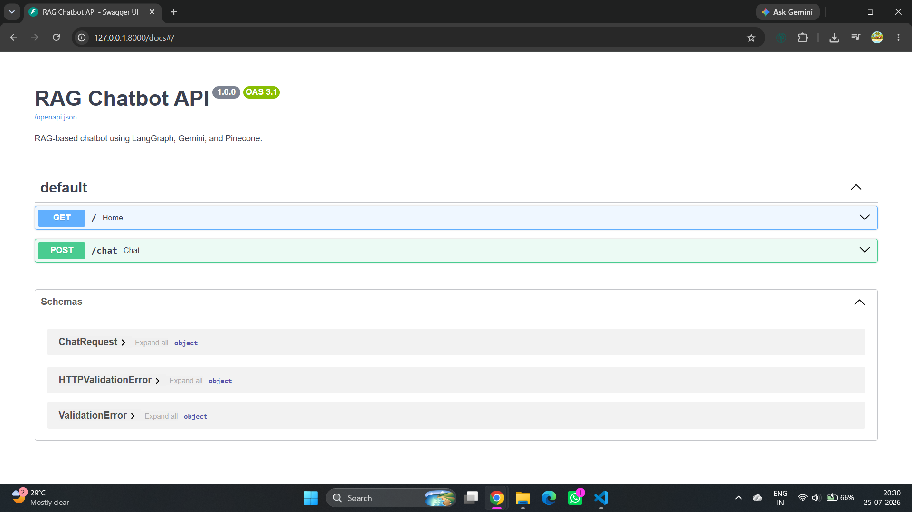
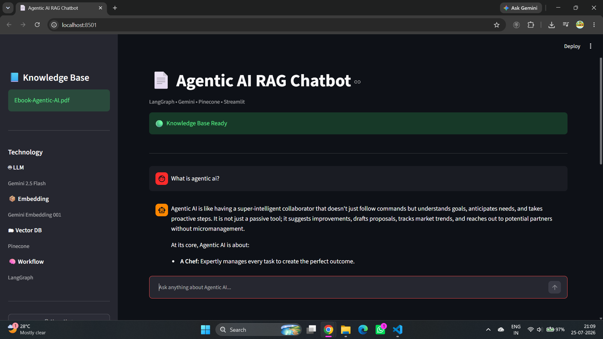

# RAG-based AI Chatbot using LangGraph

A Retrieval-Augmented Generation (RAG) chatbot built with **LangGraph**, **Google Gemini**, **Pinecone**, **FastAPI**, and **Streamlit**. The chatbot answers questions using the **Agentic AI eBook** as its knowledge base by retrieving relevant context and generating grounded responses.

---

## Features

- RAG pipeline using LangGraph
- Google Gemini LLM & Embeddings
- Pinecone vector database
- PDF ingestion
- FastAPI API
- Streamlit chatbot UI
- Retrieved context with similarity scores

---

## Architecture



```
Agentic AI eBook
       │
       ▼
 Load & Split PDF
       │
       ▼
Generate Embeddings
       │
       ▼
 Store in Pinecone
       │
       ▼
  User Question
       │
       ▼
   LangGraph RAG
       │
       ▼
Retrieve Context
       │
       ▼
 Gemini Response
       │
       ▼
 Answer + Scores
```

---

## Project Structure

```text
.
├── app.py                 # FastAPI
├── streamlit_app.py       # Streamlit UI
├── graph.py
├── ingest.py
├── config.py
├── requirements.txt
├── prompts/
├── utils/
├── data/
└── screenshots/
```

---

## Tech Stack

- Python
- LangGraph
- LangChain
- Google Gemini
- Pinecone
- FastAPI
- Streamlit

---

## Setup

### 1. Install Dependencies

```bash
pip install -r requirements.txt
```

### 2. Configure Environment Variables

Create a `.env` file.

```env
GEMINI_API_KEY=YOUR_API_KEY
PINECONE_API_KEY=YOUR_API_KEY
PINECONE_INDEX_NAME=YOUR_INDEX_NAME
PINECONE_HOST=YOUR_PINECONE_HOST
```

### 3. Index the Knowledge Base

```bash
python ingest.py
```

### 4. Run FastAPI

```bash
uvicorn app:app --reload
```

API Documentation:

```
http://127.0.0.1:8000/docs
```

### 5. Run Streamlit

```bash
streamlit run streamlit_app.py
```

---

## API

### POST `/chat`

**Request**

```json
{
  "question": "What is Agentic AI?"
}
```

**Response**

```json
{
  "question": "What is Agentic AI?",
  "answer": "...",
  "retrieved_context": [
    {
      "score": 0.8748,
      "chunk": "..."
    }
  ]
}
```

---

## Screenshots

| FastAPI Swagger | Streamlit UI |
|-----------------|--------------|
|  |  |

---

## Sample Questions

- What is Agentic AI?
- Explain the architecture of Agentic AI.
- What are Multi-Agent Systems?
- What is the planning phase?
- How does Agentic AI differ from traditional AI?

---

## Author

**Kambalapalle Kasi Reddy**

AI Engineer Internship Assignment – Appening Infotech